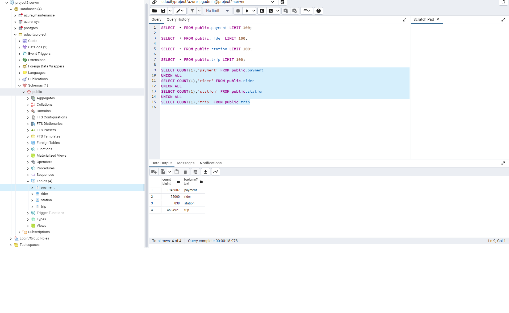

# Building an Azure Data Warehouse for Bike Share Data Analytics 
# Submitter: Quyet, Nguyen

Divvy is a bike sharing program in Chicago, Illinois USA that allows riders to purchase a pass at a kiosk or use a mobile application to unlock a bike at stations around the city and use the bike for a specified amount of time. The bikes can be returned to the same station or to another station. The City of Chicago makes the anonymized bike trip data publicly available for projects like this where we can analyze the data. The dataset looks like this:

## The goal of this project is to develop a data warehouse solution using Azure Synapse Analytics. You will:

### Design a star schema based on the business outcomes listed below;
- Import the data into Synapse;
- Transform the data into the star schema;
- Finally, view the reports from Analytics.

### The business outcomes you are designing for are as follows:
- Analyze how much time is spent per ride
- Based on date and time factors such as day of week and time of day
- Based on which station is the starting and / or ending station
- Based on age of the rider at time of the ride
- Based on whether the rider is a member or a casual rider
- Analyze how much money is spent
- Per month, quarter, year
- Per member, based on the age of the rider at account start

### Analyze how much money is spent per member
- Based on how many rides the rider averages per month
- Based on how many minutes the rider spends on a bike per month

# TASKS NEED TO DO FOR THIS PROJECT

## Task1 : Create Azure resources
    1. Azure PostgreSQL service

    2. Azure Storage Account

    3. Azure Synapse Workspace

    4. Azure Synapse SQL Dedicated Pool

## Task 2: Design a star schema

## Task 3: Create the data in PostgreSQL
To prepare your environment for this project, you first must create the data in PostgreSQL. This will simulate the production environment where the data is being used in the OLTP system. This can be done using the Python script <b>ProjectDataToPostgres.py</b>

We can verify our data is populated or not by using client tool like pgAdmin

## Task 4: EXTRACT the data from PostgreSQL
In your Azure Synapse workspace, you will use the ingest wizard to create a one-time pipeline that ingests the data from PostgreSQL into Azure Blob Storage. This will result in all four tables being represented as text files in Blob Storage, ready for loading into the data warehouse.

## Task 5: LOAD the data into external tables in the data warehouse
Once in Blob storage, the files will be shown in the data lake node in the Synapse Workspace. From here, you can use the script generating function to load the data from blob storage into external staging tables in the data warehouse you created using the Dedicated SQL Pool.

## Task 6: TRANSFORM the data to the star schema
We will create SQL scripts for transforming the data from external tables which created at step 5 to designed star schema at step 2

## Finally we have data available in dimension and fact table in Synapse use to answer business questions